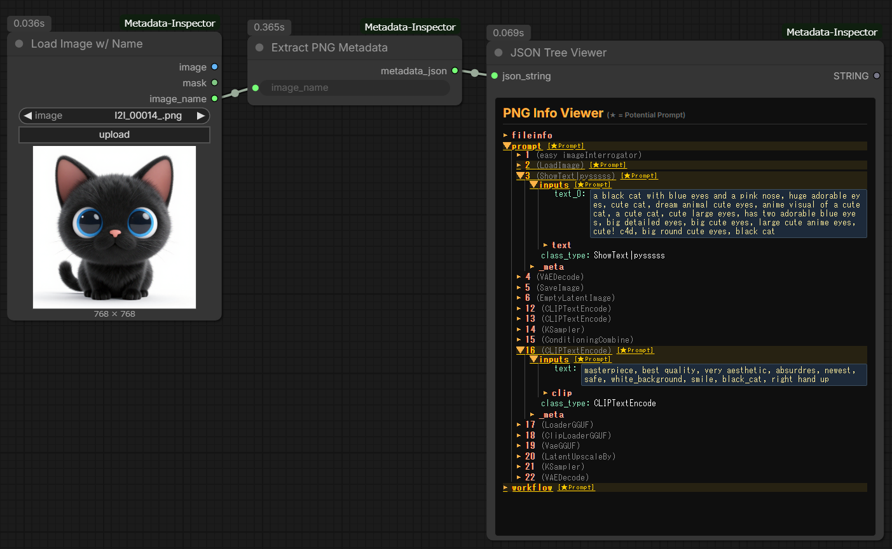

# ComfyUI-Metadata-Inspector

A specialized suite of custom nodes for ComfyUI designed to hunt down and visualize generation parameters (prompts, steps, samplers, etc.) embedded in AI-generated images. It works across different formats and platforms (ComfyUI, Automatic1111, Civitai, and more).

[](https://github.com/TakkunRed/ComfyUI-Metadata-Inspector/blob/main/LICENSE)
[](https://github.com/comfyanonymous/ComfyUI)

## Core Mission
The primary goal of this tool is to **reveal hidden prompt strings and workflow structures** from AI-generated content. Whether it's a PNG with a complex node graph or a JPEG with a text-based prompt hidden in EXIF data, this inspector brings it to light.



## Node Descriptions

This extension includes three essential nodes to complete the inspection workflow:

### 1. Load Image w/ Name
- **Purpose**: Loads an image from the `input` folder like the standard loader, and additionally outputs the file name.
- **Function**: Outputs `image`, `mask` and `image_name`. Connect `image_name` to **Extract PNG Metadata** so the inspected file always follows the loaded image.

### 2. Extract PNG Metadata (The Core)
- **Purpose**: The "brain" that scans the image file for generation data.
- **Function**: 
    - **PNG Deep Scan**: Extracts full ComfyUI/A1111 prompt and workflow JSONs.
    - **JPEG/EXIF Recovery**: Deep-scans EXIF sub-IFDs to find hidden `UserComment` (ASCII / UTF-16 `UNICODE` / JIS, big- and little-endian), `ImageDescription` and Windows `XP*` tags often used by Civitai and Tensor.art.
    - **Smart JSON Parsing**: Metadata values that are JSON (ComfyUI `prompt` / `workflow`) are expanded into structures. Plain-text metadata such as A1111 `parameters` is kept intact (JSON fragments inside the text, e.g. `Hashes: {...}`, never replace the prompt).
    - **Robust**: Binary blobs such as ICC profiles are skipped, and unreadable files / directories return an `error` field instead of stopping the workflow.
    - **Accepts**: a file name in the `input` folder, or an absolute path (surrounding double quotes are ignored). Because absolute paths are accepted, do not expose ComfyUI to untrusted networks.

### 3. JSON Tree Viewer (Web UI)
- **Purpose**: Provides a human-readable visualization of the raw data.
- **Function**: Transforms the raw metadata string into an interactive, foldable tree view directly on the ComfyUI canvas. It highlights potential prompt areas (long text) in yellow for quick identification. Click a value to copy it. All metadata is rendered as plain text, so untrusted images cannot inject HTML or scripts into the page.

## Key Features
- **Hidden Prompt Extraction**: Recovers data from JPEGs where standard tools fail.
- **Workflow Reconstruction Support**: Outputs raw JSON strings that can be used to understand complex node setups.
- **Multi-Platform Compatibility**: Supports metadata formats from ComfyUI, Automatic1111, and various web-based generators.

## Installation

### Manual Install
```bash
cd ComfyUI/custom_nodes
git clone https://github.com/TakkunRed/ComfyUI-Metadata-Inspector.git
```

## How to Use

1. Place Load Image w/ Name.
2. Connect it to Extract PNG Metadata.
3. Connect the metadata_json output to JSON Tree Viewer.
4. Input your image path and run the queue to see the hidden prompt data.

## License
MIT
